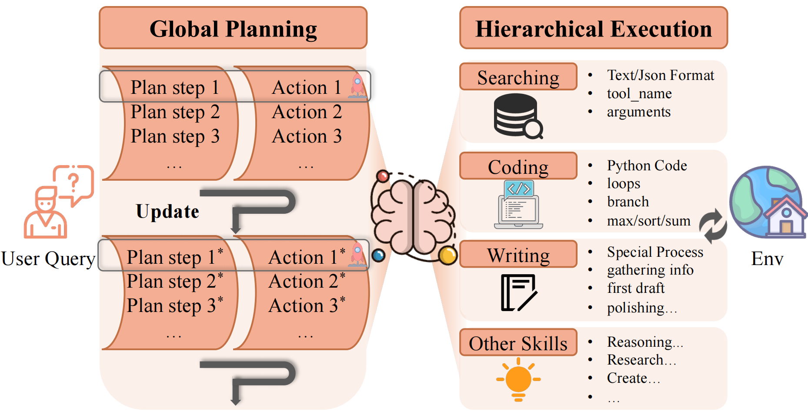

# GoalAct



## Intro
Intelligent agent systems based on Large Language Models (LLMs) have demonstrated significant potential in real-world applications. However, existing agent frameworks still suffer from critical limitations in task planning and execution, restricting their effectiveness and generalizability. Current planning methods either lack a clear global objective, causing agents to get stuck in local branches, or fail to generate executable plan steps, resulting in execution failures. At the same time, existing execution mechanisms struggle to balance complexity and stability, while their action space remains insufficient for handling diverse real-world tasks. To address these limitations, we propose GoalAct, a novel agent framework that introduces a continuously updated **global planning** mechanism and integrates a **hierarchical execution** strategy. GoalAct decomposes task execution into high-level skills, including searching, coding, writing and more, thereby reducing planning complexity while enhancing adaptability across diverse task scenarios. We evaluate GoalAct on LegalAgentBench, a benchmark that has no risk of data leakage and requires external legal knowledge for task completion. Experimental results demonstrate that GoalAct achieves state-of-the-art (SOTA) performance, with an average improvement of 12.22\% in success rate. These findings highlight GoalAct’s potential to drive the development of more advanced intelligent agent systems, making them more effective across complex real-world applications.

## Run
```bash
python GoalAct.py --model {model_name} --date {experiment_date} [--multi]
```
